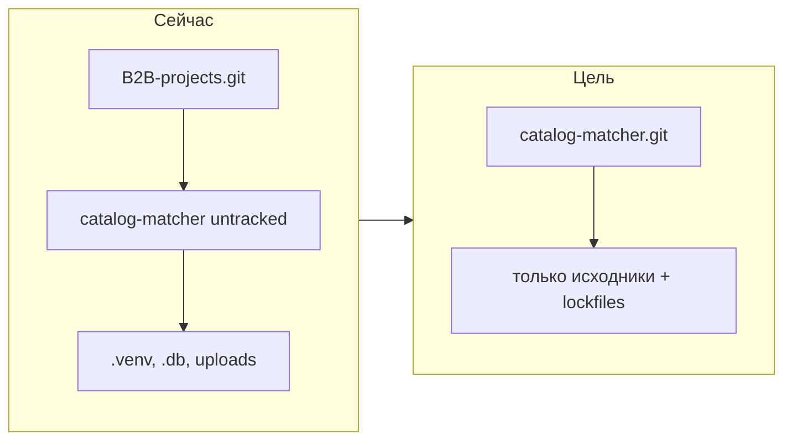

# Подготовка catalog-matcher к удалённому Git

## Текущее состояние

Проект — полноценное full-stack приложение (FastAPI + React/Vite + SQLite/Postgres). Код переносимый: относительные пути, без секретов и без жёстко прошитых путей Windows.

**Проблемы перед коммитом:**

| Проблема | Риск |
|----------|------|
| Нет собственного `.git` — папка untracked внутри родительского репозитория B2B projects | Случайный коммит вместе с Excel/PDF |
| Неполный [.gitignore](../.gitignore) | В репозиторий попадут `catalog_matcher.db` (~8 MB), `.venv` (~350 MB), `.pytest_cache` |
| Нет `.gitkeep` в `backend/data/uploads` и `exports` | Пустые папки не создадутся после `git clone` |
| [README.md](../README.md) устарел vs [README.ru.md](../README.ru.md) | На другом ПК попытка поднять Postgres вместо SQLite |
| `pytest` не в [requirements.txt](../backend/requirements.txt) | Тесты не запустятся на чистой машине |



## Шаг 1. Усилить `.gitignore`

Обновить [.gitignore](../.gitignore):

```gitignore
# Python
__pycache__/
*.pyc
.venv/
venv/
.pytest_cache/
*.db

# Env / secrets
.env
.env.local
frontend/.env.local

# Node / frontend
node_modules/
dist/
.vite/

# Runtime data (keep directory structure via .gitkeep)
backend/data/uploads/*
backend/data/exports/*
!backend/data/uploads/.gitkeep
!backend/data/exports/.gitkeep
```

Ключевое: `*.db` исключит `backend/catalog_matcher.db`; `.venv/` — оба venv (корневой и `backend/.venv`). Папка `docs/` **не игнорируется** — все файлы документации попадают в репозиторий.

## Шаг 2. Добавить недостающие файлы-заглушки

Создать пустые файлы:
- `backend/data/uploads/.gitkeep`
- `backend/data/exports/.gitkeep`

Убедиться, что папка [docs/](.) полностью включается в репозиторий:
- `docs/matching-roadmap-and-options.txt` — roadmap и варианты развития matching-движка
- `docs/chat-session-2026-07-07.txt` — сохранённая сессия разработки (история решений)

Проверить, что [backend/.env.example](../backend/.env.example) попадает в индекс (в отдельном репозитории родительский `.env.*` из B2B projects не мешает).

Содержимое `.env.example` — оставить как есть (Postgres для Docker), добавить комментарий про SQLite по умолчанию:

```
# Optional. Without this, backend uses SQLite: sqlite:///./catalog_matcher.db
DATABASE_URL=postgresql://postgres:postgres@db:5432/catalog_matcher
```

## Шаг 3. Синхронизировать документацию

Обновить [README.md](../README.md) по образцу [README.ru.md](../README.ru.md):
- Локальный запуск **без Postgres** (SQLite по умолчанию)
- Инструкции для **Windows** (`.\.venv\Scripts\Activate.ps1`) и Unix
- Описание batch-export и best-matches export (уже реализованы в API/UI)
- Требования: **Python 3.11+**, **Node 20+**, Docker (опционально)
- Раздел «Первый запуск на новом компьютере»:

```bash
# Вариант A — Docker (рекомендуется)
docker compose up --build

# Вариант B — локально
cd backend && python -m venv .venv && pip install -r requirements.txt
uvicorn app.main:app --reload
# в другом терминале:
cd frontend && npm ci && npm run dev
```

Добавить [backend/requirements-dev.txt](../backend/requirements-dev.txt):

```
-r requirements.txt
pytest>=8.0
```

## Шаг 4. Инициализировать отдельный Git-репозиторий

Выполнить **только внутри** корня проекта `catalog-matcher/`:

```powershell
cd "...\catalog-matcher"
git init
git add .
git status   # проверка: нет .venv, *.db, node_modules, uploads/*.xlsx; есть docs/*
git commit -m "Initial commit: catalog matcher MVP"
```

**Не делать** `git push` — только локальная подготовка.

Опционально: добавить `catalog-matcher/` в `.gitignore` родительского репозитория B2B projects, чтобы два git-репозитория не конфликтовали.

## Шаг 5. Инструкция для будущего push (не выполнять сейчас)

Когда будете готовы отправить в GitHub:

```powershell
# Создать пустой репозиторий на GitHub, затем:
git remote add origin https://github.com/<user>/catalog-matcher.git
git branch -M main
git push -u origin main
```

## Что останется локально (не в Git)

- `backend/catalog_matcher.db` — рабочая БД
- `backend/data/uploads/*.xlsx` — загруженные каталоги
- `backend/data/exports/*.xlsx` — экспорты
- `.venv/`, `node_modules/` — зависимости (восстанавливаются через pip/npm)

На новом компьютере пользователь загружает свои Excel-файлы через UI — шаблоны в репозиторий не нужны.

## Итоговый состав репозитория

```
catalog-matcher/
├── .gitignore
├── README.md, README.ru.md
├── docker-compose.yml
├── backend/          # app/, tests/, Dockerfile, requirements*
├── frontend/         # src/, package-lock.json, Dockerfile
└── docs/             # вся документация проекта
    ├── matching-roadmap-and-options.txt
    ├── chat-session-2026-07-07.txt
    └── git-repo-preparation-plan.md
```
